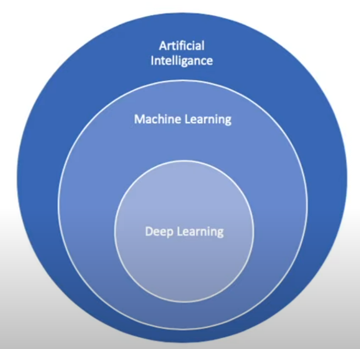

# RelationShip Between AI vs ML vs Deep Learning

# What is AI 
Artificial Intelligence is a branch of Computer Science that is concerned with building smart & intelligent Machines

# What is ML
Machine learning is a technique to implement AL that can learn from the data by themselves without being explicitly programmed.

# What is DL
Deep Learning is a subfield of Machine Learning that uses Artificial Neural Networks to learn from the data

# Machine-Learning

Machine learning (ML) is a type of artificial intelligence (AI) that allows software applications to become more accurate at predicting outcomes without
being explicitly programmed to do so. Machine learning algorithms use historical data as input to predict new output values. 
popular uses include fraud detection, spam filtering, malware threat detection

* [Data Preprocessing]()
    * [Data Cleaening]()
    * [Categorical Encoding]()
    * [Feature Scaling]()
* [Regression]()
* [Classification]()
* [Clustering]()
* [Association Rule]()
* [Reiforcement Learning]()
* [Natural Language Precessing]()
* [Deep Learning]()
